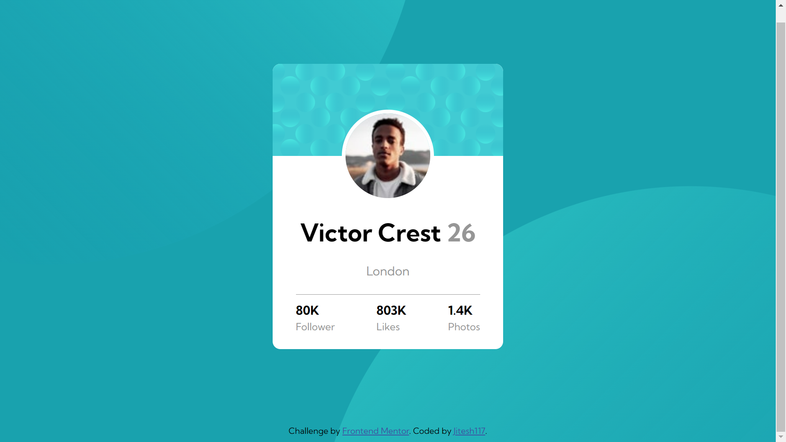

# Frontend Mentor - Profile card component solution

This is a solution to the [Profile card component challenge on Frontend Mentor](https://www.frontendmentor.io/challenges/profile-card-component-cfArpWshJ). Frontend Mentor challenges help you improve your coding skills by building realistic projects. 

## Table of contents

- [Overview](#overview)
  - [The challenge](#the-challenge)
  - [Screenshot](#screenshot)
  - [Links](#links)
- [My process](#my-process)
  - [Built with](#built-with)
  - [What I learned](#what-i-learned)
  - [Continued development](#continued-development)
  - [Useful resources](#useful-resources)
- [Author](#author)
- [Acknowledgments](#acknowledgments)

**Note: Delete this note and update the table of contents based on what sections you keep.**

## Overview

### The challenge

- Build out the project to the designs provided

### Screenshot




### Links

- Solution URL: [Add solution URL here](https://your-solution-url.com)
- Live Site URL: [Add live site URL here](https://your-live-site-url.com)

## My process

### Built with

- Semantic HTML5 markup
- CSS custom properties
- Flexbox

- Mobile-first workflow


### What I learned

There are two things which I learned for the first time while doing this challenge.
- How and when to use negative margins

```html

```
```css
.pfp{
    border-radius: 50%;
    margin: -20%  auto;
    width:40%;
    border: 5px solid white;
}
```
- How to use two background images
 ```css
 body{
    background-color: hsl(185, 75%, 39%);
    background-image: url(images/bg-pattern-top.svg),url(images/bg-pattern-bottom.svg);
    background-position:  bottom 40vh right 45vw,top 45vh left 40vw;
    background-repeat: no-repeat;
    font-family: 'Kumbh Sans', sans-serif;
}
 ```

### Continued development

I'd want to continue to learn some more things about multiple backgrounds and negative margins and when to use them.

### Useful resources

- [Kevin Powell](https://twitter.com/KevinJPowell) - Kevin is a CSS evangelist and really makes CSS stuff easy for a lot of folks through his twitch and youtube videos.
- [Anosha Ahmed's github repo](https://github.com/anoshaahmed/accessibility-info) - I always used to get accessibility issues when I submitted the solutions to the frontendmentor challenges. This repo created by [Anosha](https://github.com/anoshaahmed) really helped me.

## Author

- Website - [Jitesh117](https://www.your-site.com)
- Frontend Mentor - [@jitesh117](https://www.frontendmentor.io/profile/jitesh117)
- Twitter - [@jitesh_117](https://www.twitter.com/jitesh_117)

**Note: Delete this note and add/remove/edit lines above based on what links you'd like to share.**

## Acknowledgments

I was having some issues with the background image properties and I reached out to [Anosha](https://twitter.com/anoshaahmed) on twitter and she helped me understand how to use multiple backgrounds. She is really active on frontendmentor and is very helpful.

